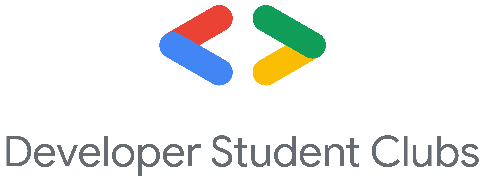

# Flutter-Talks

Flutter Talks is a Community of Flutter Developers under Developer Students Club Parul University, where we organize workshops, and sessions on Flutter. It's an open community, and anyone from novice developer to advance developer can attend the sessions.

We organize workshops on every 2nd and 3rd Thursday of every month from 2:30 PM to 4:30 PM

     

# Submitting a CFP

If anyone who is interested in giving a session on Flutter can submit a CFP in the issues.
